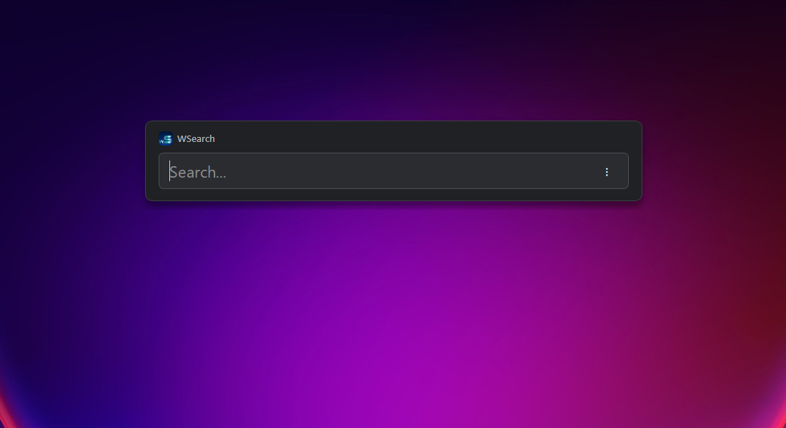
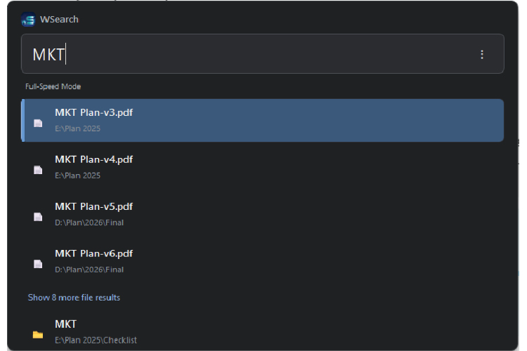
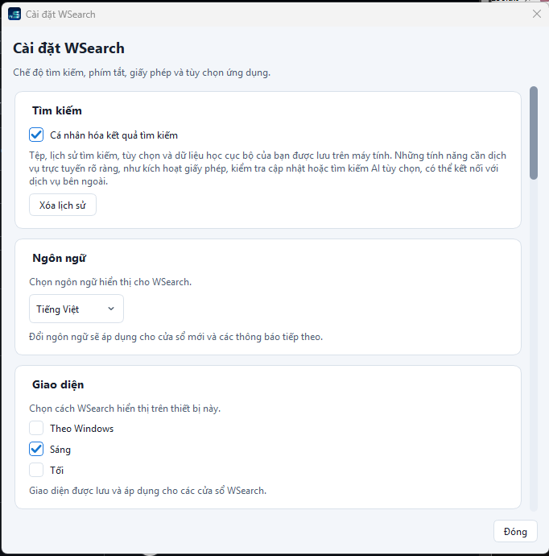
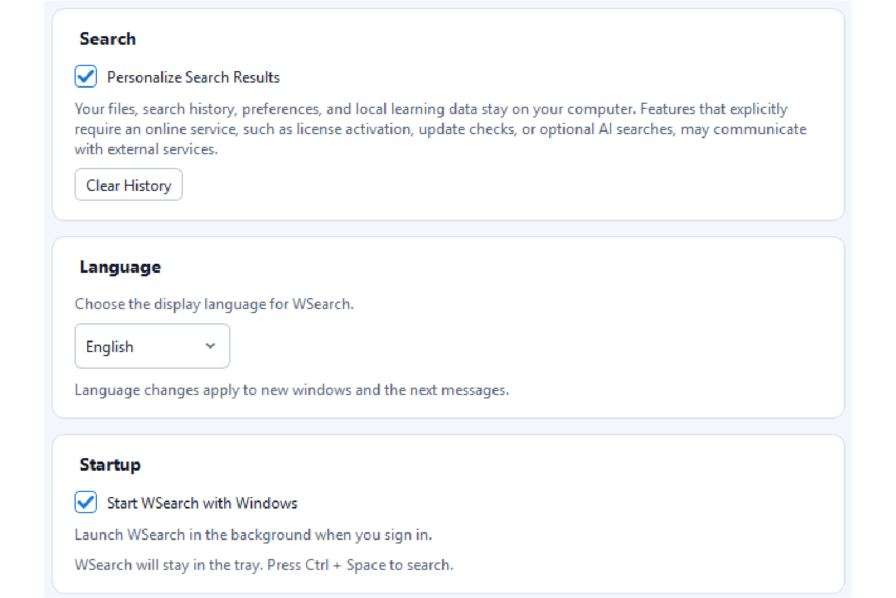
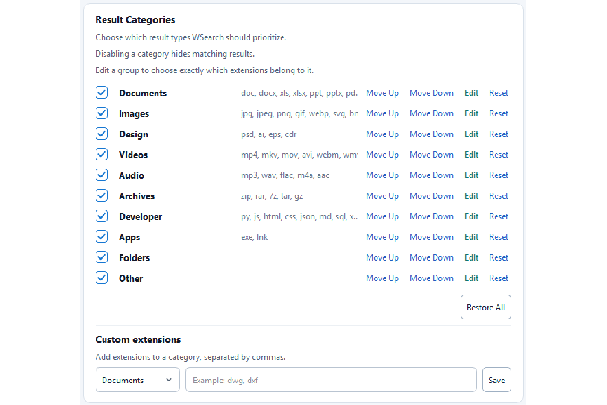
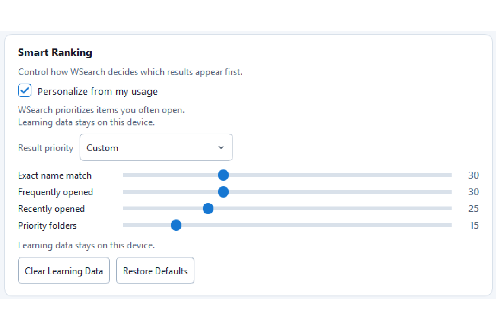

# WSearch

> **You didn't forget the file.  
> You just forgot where you saved it.**

WSearch is a lightweight Windows search app that helps you find files, folders, and apps faster.

Instead of digging through your entire computer, WSearch lets you focus on the places that actually matter, so you can get back to work sooner.

---

## Screenshots

### Main Search

### Search Results

### Search Settings

### Advanced Search

---

## Why WSearch?

There are already many search tools for Windows.

After using them for years, I realized the real problem wasn't that I couldn't find my files.

The problem was finding far too much.

I wanted one document.

Instead, I often got cache files, temporary folders, system files, and results I never intended to open.

So WSearch follows one simple idea:

> **Don't search more. Search better.**

---

## Features

- Find files, folders, and Windows apps
- Search only where you want
- Cleaner search results
- Frequently opened results become easier to find
- Lightweight and responsive
- Local-first design
- Windows 10 & Windows 11

---

## Download

The latest stable release is always recommended.

👉 Download from the official website:

https://app.ezwhy.com/wsearch/

Older releases are available in the GitHub Releases page.

---

## Learn More

The GitHub repository is intended to introduce WSearch and provide release history.

For detailed documentation, feature comparison, screenshots, FAQs, and the latest updates, please visit:

https://app.ezwhy.com/wsearch/

---

## Support

Found a bug?

Have an idea?

Think WSearch could be better?

I'd love to hear from you.

📧 admin@ezwhy.com

---

## About ezWhy

ezWhy builds small Windows apps that solve real everyday problems.

Not every tool needs hundreds of features.

Sometimes saving a few minutes every day is already worth it.

WSearch is part of the W-Series applications by ezWhy.

---

## Releases

Looking for an older version?

All previous releases are available here:

https://github.com/ezWhy/WSearch/releases

---

## License

For licensing, privacy policy, terms, and related information, please visit:

https://app.ezwhy.com/legal/
